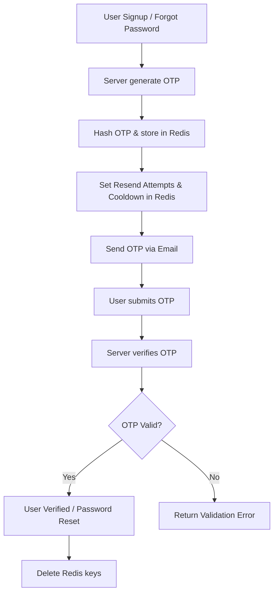

# 💬 Saraha App - Backend

A **secure and scalable backend** for an anonymous messaging platform, inspired by Saraha. Users can register, verify email via OTP, login, reset passwords, and receive anonymous messages.  

This project demonstrates **real-world backend development skills**, including authentication, JWT-based sessions, email verification, file uploads, Redis caching, and rate-limiting.

---

## 📌 Project Overview

- **User registration** with email verification via OTP  
- **Authentication & Authorization** with JWT (access + refresh tokens)  
- **Profile management**: view profiles, update info, change password  
- **Anonymous messaging** system  
- **Photo uploads**: profile avatar + gallery  
- **Security features**: rate limiting, hashed passwords, token revocation  
- **Caching & temporary storage**: Redis for OTPs and resend attempts  

---

## ⚙️ Tech Stack

- **Node.js** + **Express.js**  
- **MongoDB** with Mongoose  
- **Redis** for OTPs, cooldowns, and blocking  
- **JWT** for access and refresh tokens  
- **Cloudinary** for file uploads  
- **Rate limiting**: email-based, IP-based, and file uploads  
- **Email service**: OTP verification & password reset  

---


### Key Concepts
- **Repository pattern** for DB operations (`DatabaseRepository`)  
- **Event-driven OTP/email sending** using `eventEmitter`  
- **JWT refresh tokens** with revocation in DB (`tokenModel`)  
- **Rate limiting** per email, per IP, and per file upload  
- **Optional authentication** for public profile viewing  

---

## 🔌 API Endpoints

### User Routes (`/api/users`)

| Method | Endpoint | Auth | Description |
|--------|---------|------|-------------|
| POST   | `/signup` | ❌ | Register a new user and send OTP |
| POST   | `/verify-email` | ❌ | Verify user email with OTP |
| POST   | `/resend-otp` | ❌ | Resend OTP with rate-limit & block handling |
| POST   | `/signin` | ❌ | Login user and return access + refresh tokens |
| POST   | `/refreshToken` | ❌ | Refresh access token using refresh token |
| POST   | `/logout` | ✅ | Logout and revoke refresh token |
| GET    | `/profile/:id` | Optional | View user profile |
| GET    | `/profile/:id/share` | ❌ | Get public shareable profile link |
| PATCH  | `/profile` | ✅ | Update user info (firstName, lastName, email) |
| PATCH  | `/password` | ✅ | Change user password |
| PATCH  | `/forget-password` | ❌ | Request OTP for password reset |
| PATCH  | `/reset-password` | ❌ | Reset password using OTP |
| POST   | `/upload` | ✅ | Upload avatar & gallery images |
| DELETE | `/profileImage` | ✅ | Delete profile picture |

---

### Message Routes (`/api/users/:id/messages`)

| Method | Endpoint | Auth | Description |
|--------|---------|------|-------------|
| POST   | `/` | ❌ | Send anonymous message to a user |
| GET    | `/` | ✅ | Get received messages (only logged-in user) |

---

## 🔒 Security Features

- Password hashing with **bcrypt**  
- JWT-based authentication with access + refresh tokens  
- Rate limiting using Redis:  
  - **Email limiter** for login attempts  
  - **OTP resend limiter**  
  - **IP limiter** for endpoints  
- Optional authentication for public profile views  
- Token revocation on logout  

---

## 🔄 Flow Diagrams

### 1️⃣ OTP Flow (Email Verification & Password Reset)



### 2️⃣ JWT Authentication Flow

```mermaid
flowchart TD
    A[User Sign-In] --> B[Server validates credentials]
    B --> C[Generate Access Token (15m)]
    B --> D[Generate Refresh Token (30d)]
    C --> E[Use Access Token for API requests]
    D --> F[Use Refresh Token to get new Access Token]
    F --> G[Server verifies Refresh Token]
    G --> H{Token revoked?}
    H -- No --> I[Issue new Access Token]
    H -- Yes --> J[Return Auth Error]
```

### 3️⃣ Redis Usage Flow

```mermaid
flowchart TD
    A[Server generates OTP] --> B[Store hashed OTP: otp:{email}, TTL 10m]
    B --> C[Store cooldown: otp:{email}:cooldown, TTL 60s]
    B --> D[Store resendAttempts: otp:{email}:resendAttempts]
    E[User requests resend OTP] --> F{Check block key?}
    F -- Yes --> G[Return Blocked Error]
    F -- No --> H{Check cooldown?}
    H -- Yes --> I[Return Wait Error]
    H -- No --> J{Check resendAttempts >= 5?}
    J -- Yes --> K[Set block key, delete OTP & attempts]
    J -- No --> L[Increment resendAttempts, send OTP]
```
